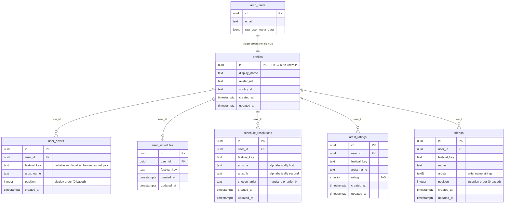

# Festplan — Supabase Schema

> Migration file: `supabase/migrations/0001_user_state.sql`
>
> All six tables live in the `public` schema.  Row Level Security is **enabled
> on every table** and all policies restrict access to the row's owning user
> (`user_id = auth.uid()` or `id = auth.uid()` for `profiles`).

---

## ER Diagram



---

## Table Reference

### `profiles`

One row per authenticated user.  Created automatically by the
`handle_new_user` trigger when Supabase Auth inserts a new row into
`auth.users` after the Spotify OAuth flow completes.

| Column         | Type          | Notes                                        |
|----------------|---------------|----------------------------------------------|
| `id`           | `uuid` PK     | References `auth.users(id)`, cascades on delete |
| `display_name` | `text`        | From Spotify `full_name` / `name` metadata   |
| `avatar_url`   | `text`        | From Spotify `avatar_url` / `picture`        |
| `spotify_id`   | `text`        | Spotify user ID (without `spotify:` prefix)  |
| `created_at`   | `timestamptz` | Set on insert                                |
| `updated_at`   | `timestamptz` | Updated by `set_updated_at` trigger          |

**RLS:** owner can `SELECT` and `UPDATE` their own row.  `INSERT` is
service-role only (trigger).

---

### `user_artists`

The ordered list of artists the user is planning with, scoped to an optional
festival.  Mirrors the `myArtists` state array in `SetupPage` /
`SchedulePage`.

| Column         | Type          | Notes                                             |
|----------------|---------------|---------------------------------------------------|
| `id`           | `uuid` PK     |                                                   |
| `user_id`      | `uuid` FK     | → `profiles(id)`                                 |
| `festival_key` | `text`        | `NULL` = global list (pre-festival pick)         |
| `artist_name`  | `text`        | Non-empty; unique per `(user_id, festival_key)`   |
| `position`     | `integer`     | 0-based; read with `ORDER BY position ASC`        |
| `created_at`   | `timestamptz` |                                                   |

**Unique constraint:** `(user_id, festival_key, artist_name)`

**RLS:** owner can `SELECT`, `INSERT`, `UPDATE`, `DELETE`.

**Frontend key mapping:**
```js
// Read
const { data } = await supabase
  .from('user_artists')
  .select('artist_name')
  .eq('festival_key', festId)
  .order('position')

// Write (upsert list)
await supabase.from('user_artists').upsert(
  myArtists.map((name, i) => ({ user_id, festival_key: festId, artist_name: name, position: i })),
  { onConflict: 'user_id,festival_key,artist_name' }
)
```

---

### `user_schedules`

Records which festival(s) a user has an active plan for.  One row per
`(user, festival_key)`.  The current localStorage value `festplan_festival`
maps to a single row in this table.

| Column         | Type          | Notes                             |
|----------------|---------------|-----------------------------------|
| `id`           | `uuid` PK     |                                   |
| `user_id`      | `uuid` FK     | → `profiles(id)`                 |
| `festival_key` | `text`        | e.g. `"lowlands"`, `"coachella"` |
| `created_at`   | `timestamptz` |                                   |
| `updated_at`   | `timestamptz` |                                   |

**Unique constraint:** `(user_id, festival_key)`

**RLS:** owner can `SELECT`, `INSERT`, `UPDATE`, `DELETE`.

---

### `schedule_resolutions`

The user's choice when two of their artists overlap on the timetable.  Mirrors
the `resolved` state object in `SchedulePage`:
`{ [key: string]: chosenArtistName }`.

The frontend builds the conflict key as
`[artist_a, artist_b].sort().join('|||')`.  The database mirrors this by
enforcing `artist_a < artist_b` (alphabetical), so the canonical form is
always preserved and the key can be reconstructed from the two columns
without ambiguity.

| Column          | Type          | Notes                                          |
|-----------------|---------------|------------------------------------------------|
| `id`            | `uuid` PK     |                                                |
| `user_id`       | `uuid` FK     | → `profiles(id)`                              |
| `festival_key`  | `text`        |                                                |
| `artist_a`      | `text`        | Alphabetically first (JS `.sort()[0]`)         |
| `artist_b`      | `text`        | Alphabetically second (JS `.sort()[1]`)        |
| `chosen_artist` | `text`        | Must equal `artist_a` or `artist_b`            |
| `created_at`    | `timestamptz` |                                                |
| `updated_at`    | `timestamptz` |                                                |

**Unique constraint:** `(user_id, festival_key, artist_a, artist_b)`

**Check constraints:**
- `chk_artist_order`: `artist_a < artist_b`
- `chk_valid_choice`: `chosen_artist = artist_a OR chosen_artist = artist_b`

**RLS:** owner can `SELECT`, `INSERT`, `UPDATE`, `DELETE`.

**Frontend key mapping:**
```js
// Reading back into the resolved{} object
const { data } = await supabase
  .from('schedule_resolutions')
  .select('artist_a, artist_b, chosen_artist')
  .eq('festival_key', festId)

const resolved = Object.fromEntries(
  data.map(r => [`${r.artist_a}|||${r.artist_b}`, r.chosen_artist])
)

// Writing a resolution
const [a, b] = [artistA, artistB].sort()
await supabase.from('schedule_resolutions').upsert(
  { user_id, festival_key: festId, artist_a: a, artist_b: b, chosen_artist: chosen },
  { onConflict: 'user_id,festival_key,artist_a,artist_b' }
)
```

---

### `artist_ratings`

Star ratings (1–5) per artist per festival.  Mirrors the `ratings` state
object: `{ [artistName]: starCount }`.

| Column         | Type          | Notes                                    |
|----------------|---------------|------------------------------------------|
| `id`           | `uuid` PK     |                                          |
| `user_id`      | `uuid` FK     | → `profiles(id)`                        |
| `festival_key` | `text`        |                                          |
| `artist_name`  | `text`        |                                          |
| `rating`       | `smallint`    | Integer 1–5; matches 5-star UI           |
| `created_at`   | `timestamptz` |                                          |
| `updated_at`   | `timestamptz` |                                          |

**Unique constraint:** `(user_id, festival_key, artist_name)`

**Check constraint:** `rating BETWEEN 1 AND 5`

**RLS:** owner can `SELECT`, `INSERT`, `UPDATE`, `DELETE`.

**Frontend key mapping:**
```js
// Reading back into ratings{}
const { data } = await supabase
  .from('artist_ratings')
  .select('artist_name, rating')
  .eq('festival_key', festId)

const ratings = Object.fromEntries(data.map(r => [r.artist_name, r.rating]))

// Upserting a rating click
await supabase.from('artist_ratings').upsert(
  { user_id, festival_key: festId, artist_name: artist, rating: stars },
  { onConflict: 'user_id,festival_key,artist_name' }
)
```

---

### `friends`

Friends manually added to the group schedule tab.  Mirrors the `friends`
state array: `[{ name: string, artists: string[] }]`.

| Column         | Type          | Notes                                          |
|----------------|---------------|------------------------------------------------|
| `id`           | `uuid` PK     |                                                |
| `user_id`      | `uuid` FK     | → `profiles(id)`                              |
| `festival_key` | `text`        |                                                |
| `name`         | `text`        | Friend's display name                          |
| `artists`      | `text[]`      | Array of artist name strings (comma-split in UI) |
| `position`     | `integer`     | 0-based insertion order (UI cap: 3 friends)    |
| `created_at`   | `timestamptz` |                                                |
| `updated_at`   | `timestamptz` |                                                |

**RLS:** owner can `SELECT`, `INSERT`, `UPDATE`, `DELETE`.

**Frontend key mapping:**
```js
// Reading back into friends[]
const { data } = await supabase
  .from('friends')
  .select('id, name, artists')
  .eq('festival_key', festId)
  .order('position')

// setFriends(data)  — shape matches { name, artists } state directly

// Adding a friend
await supabase.from('friends').insert({
  user_id,
  festival_key: festId,
  name: newFName,
  artists: newFArtists.split(',').map(a => a.trim()).filter(Boolean),
  position: friends.length,
})

// Removing a friend
await supabase.from('friends').delete().eq('id', friendId)
```

---

## Trigger: `handle_new_user`

```
auth.users INSERT  →  trg_on_auth_user_created  →  handle_new_user()
                                                        ↓
                                                 INSERT INTO profiles
```

- Runs `AFTER INSERT ON auth.users`, `FOR EACH ROW`.
- Defined as `SECURITY DEFINER` so it runs as the table owner and bypasses
  RLS on `profiles`.
- Uses `ON CONFLICT (id) DO NOTHING` so re-sign-in (same Spotify account)
  does not overwrite existing profile data.
- Reads from `NEW.raw_user_meta_data` (Supabase JSON blob populated by the
  Spotify identity provider) to extract `display_name`, `avatar_url`, and
  `spotify_id`.

---

## RLS Policy Summary

| Table                  | SELECT | INSERT | UPDATE | DELETE |
|------------------------|--------|--------|--------|--------|
| `profiles`             | owner  | trigger only | owner | —      |
| `user_artists`         | owner  | owner  | owner  | owner  |
| `user_schedules`       | owner  | owner  | owner  | owner  |
| `schedule_resolutions` | owner  | owner  | owner  | owner  |
| `artist_ratings`       | owner  | owner  | owner  | owner  |
| `friends`              | owner  | owner  | owner  | owner  |

"owner" = `user_id = auth.uid()` (or `id = auth.uid()` for `profiles`).

---

## Indexes

| Index name                               | Table                  | Columns                    |
|------------------------------------------|------------------------|----------------------------|
| `idx_user_artists_user_festival`         | `user_artists`         | `(user_id, festival_key)`  |
| `idx_user_schedules_user`                | `user_schedules`       | `(user_id)`                |
| `idx_schedule_resolutions_user_festival` | `schedule_resolutions` | `(user_id, festival_key)`  |
| `idx_artist_ratings_user_festival`       | `artist_ratings`       | `(user_id, festival_key)`  |
| `idx_friends_user_festival`              | `friends`              | `(user_id, festival_key)`  |

All queries issued by the frontend filter by `user_id` (enforced by RLS
anyway) and `festival_key`, so a composite index on both is sufficient for
all access patterns.
